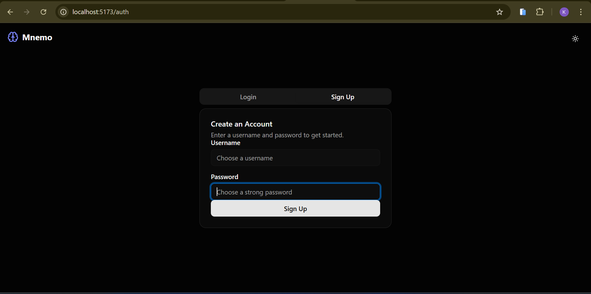
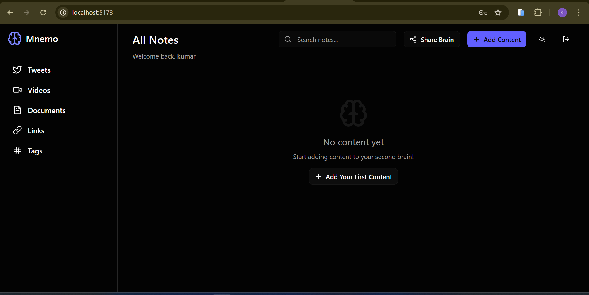
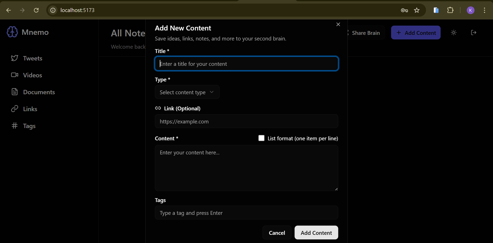
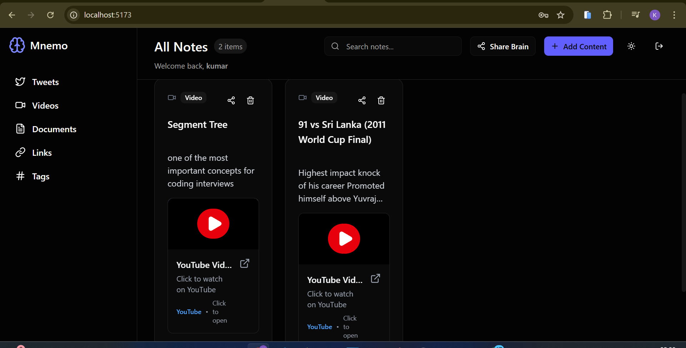
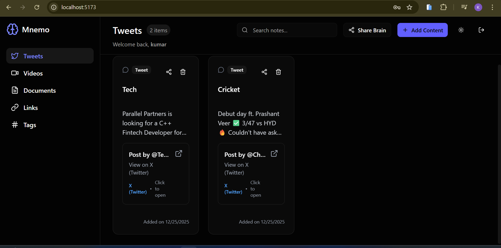
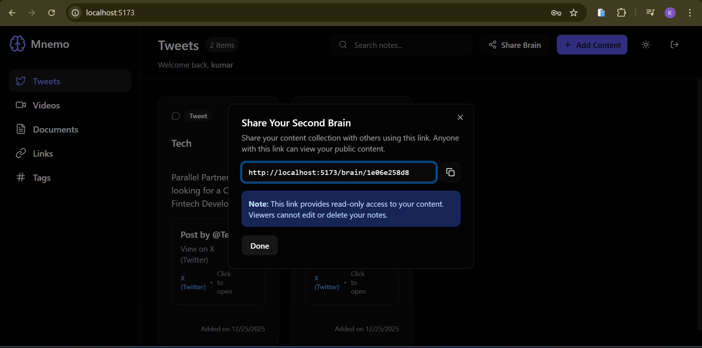
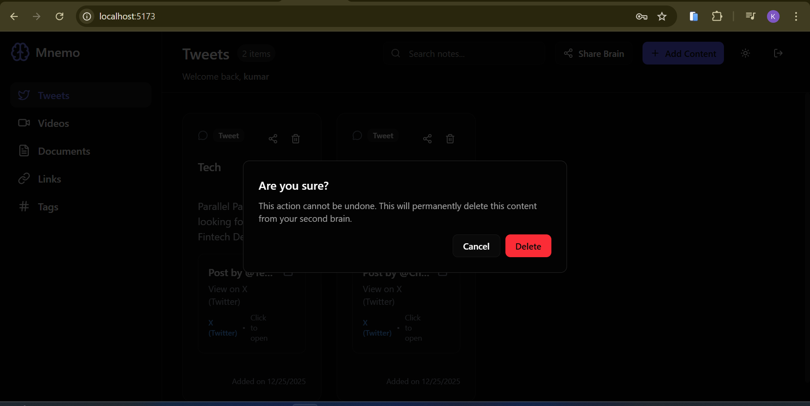

# Mnemo — Your Second Brain

Mnemo is a second-brain web application that helps users capture, organize, and revisit knowledge from multiple sources such as YouTube, Twitter, and documents — all in one centralized place.

It is built with a **TypeScript + Node.js backend** and a **React (Vite) frontend**, focusing on security, performance, and a clean user experience.

## 🎥 Demo
<div style="display:flex;flex-wrap:wrap;gap:12px;">
These images show key screens and user flows in Mnemo — for example: Sign Up / Login, Home (notes listing), Add Content dialog, Content cards, Share link flow, Sidebar, and Dark mode. They provide a quick visual overview of the product and its UI.


<div style="display:flex;flex-direction:column;gap:18px;align-items:center;">
  
  
  
  
  
  
  
</div>

---

## 🚀 Features

- 🧠 Centralized second-brain for notes & links
- 📦 Content management (add, view, share)
- 🔗 Share knowledge via public links
- 🔐 Authentication & protected routes
- 🌐 Public & private routes with access control
- 🎨 Modern UI powered by shadcn/ui & TailwindCSS
- 🌙 Dark mode support
- ⚡ Built with TypeScript for type safety

---

## 📂 Project Structure

```
mnemo-your-second-brain
├─ backend        # Node.js + Express + MongoDB (TypeScript)
│  ├─ src         # Source code
│  ├─ dist        # Compiled JS
│  ├─ .env        # Environment variables (create from .env.example)
│  └─ tsconfig.json
│
├─ frontend       # React + Vite + Tailwind + shadcn/ui
│  ├─ src         # Components, pages, store, utils
│  ├─ public      # Static assets
│  └─ vite.config.ts
│
└─ README.md

```

---

## ⚙️ Setup & Installation

### 1. Clone the repository

```bash
git clone https://github.com/your-username/mnemo-your-second-brain.git
cd mnemo-your-second-brain
```

### 2. Backend Setup

```bash
cd backend
npm install
cp .env.example .env   # configure environment variables
npm start
```

Backend runs at: **http://localhost:3000**

### 3. Frontend Setup

```bash
cd frontend
npm install
npm run dev
```

Frontend runs at: **http://localhost:5173**

---

## 🔑 Environment Variables

The backend requires a `.env` file. Use the provided `.env.example` as a reference.

```ini
# Server
PORT=3000

# Database
MONGO_URI=mongodb://localhost:27017/mnemo

# Authentication
JWT_SECRET=your_jwt_secret_here
JWT_EXPIRES_IN=1d
```

> ⚠️ Never commit your real `.env` file to GitHub. Only share `.env.example`.

---

## 🧠 Why Mnemo?

The human brain is great at thinking, not storing.  
Mnemo acts as an external memory system — a place to store ideas, resources, and knowledge so you can focus on learning and creating.

---

## 🛠 Tech Stack

**Backend:**

- Node.js, Express, TypeScript
- MongoDB (Mongoose)
- JWT Authentication

**Frontend:**

- React (Vite + TypeScript)
- TailwindCSS + shadcn/ui
- Zustand for state management
- React Router v6

---

## 👨‍💻 Author

**Kumar Gourav**  
MCA ’25 | Full Stack Developer  
Built as a portfolio project to explore modern full-stack architecture and product thinking.

---

## 📜 License

This project is licensed under the MIT License.

---

## Render Deployment

This repo includes a root `render.yaml` for Blueprint deploy with 2 services:

- `mnemo-backend` (Node web service)
- `mnemo-frontend` (static site)

### 1. Push code to GitHub

```bash
git add .
git commit -m "Add Render deployment config"
git push
```

### 2. Create services from Blueprint

1. Open Render dashboard.
2. Click **New +** -> **Blueprint**.
3. Select this repository.
4. Render will detect `render.yaml` and create both services.

### 3. Set required backend env vars in Render

- `DB_URL` = your MongoDB Atlas connection string
- `JWT_SECRET` = strong random secret

`PORT` is injected by Render automatically for web services.

### 4. Set frontend API URL

After backend deploy is live, update frontend env var:

- `VITE_API_URL=https://<your-backend-service>.onrender.com/api/v1`

Then redeploy frontend once.

### 5. Health check

Backend health endpoint:

- `/api/v1/health`
